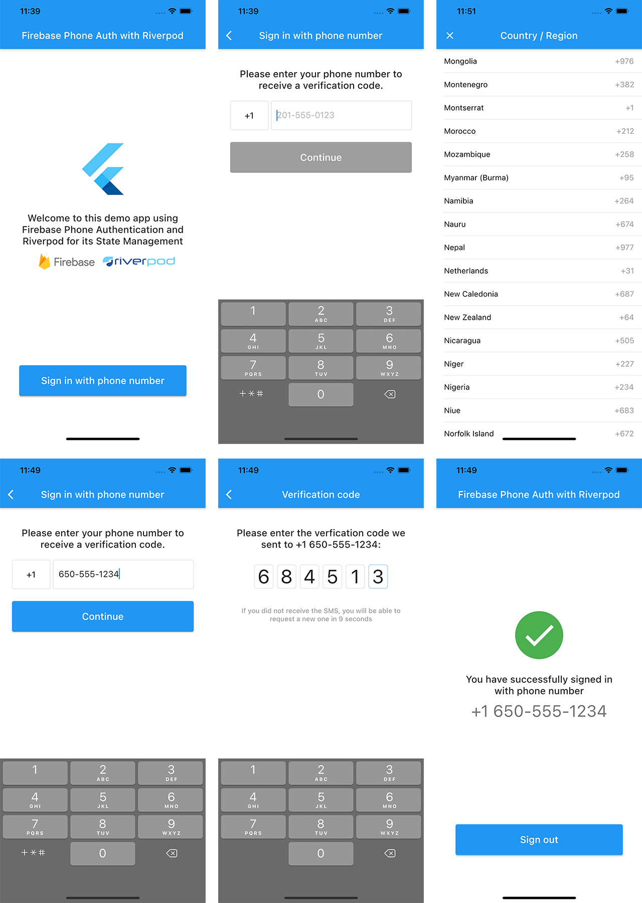

[](https://twitter.com/hikeland)

# Flutter Firebase Phone Auth with Riverpod

This example project shows how to set up a Firebase Phone Auth in Flutter with Riverpod for its state management



### Running the app

You will need to setup [Firebase](https://console.firebase.com) and add the **GoogleService-Info.plist** to the iOS project and **google-services.json** to the Android project.
Don't forget to enable **Phone Authentication** on your Firebase project.

## App Overview

The app displays a landing screen when the user is not authenticated.

Then the user can move to a sign-in flow with phone authentication, where he can select his country to get the right phone code.

When the verification code is sent, the user is moved to a new screen requesting the verification code. 

A countdown is displayed before the user can make a new verification code request, to avoid excessive requests.

When the verification code is approved, the user is moved to a home page with a logout button.

### Phone number request 

On this screen, the user is asked to type his phone number. His country has been automatically detected by the app but he can change it by typing the country code, which open a new screen with all the countries available and their phone code.
The phone number is automatically formatted and verified as it is entered, filling spaces and dashes when needed. An error is displayed if the phone number is not a mobile number.
When the phone number is detected as valid, the "Continue" button is enabled.

### Verification code request

This screen displays a TextField where the user is asked to type the verification code. Since we know that Firebase verification codes is 6-digit, the TextField is formatted to fit this structure.
There is no validation button on this screen because the TextField autovalidates the code when it reaches the 6th number.
The user can request a new verification code on this screen, but only after a delay, to avoid repeated requests. 

## Third party librairies

This app uses some external librairies:

- [x] [Flutter_libphonenumber](https://pub.dev/packages/flutter_libphonenumber) to manage country codes and phone number formatting
- [x] [Riverpod](https://pub.dev/packages/riverpod) for the state management
- [x] [Freezed](https://pub.dev/packages/freezed) for building immutable state classes
- [x] [Pinput](https://pub.dev/packages/pinput) for the verification code TextField

## App Structure

The project is structured like this:

```
/app
  /common_widgets
  /home
  /routing
  /sign_in
/services
/state
```

`lib` folder only contains **main.dart** which the first screen and **global_providers.dart** which contain the providers accessible from everywhere in the app.

Then inside `lib` you will find:
- `state` which contains our "freezed" state files
- `services` with contains the AuthService class
- `app` with all the app stuff, with more details below.

All widgets which are used more than once are stored in `app/common_widgets`, for example the blue ElevatedButton.
All routes of the app are stored in `app/routing`.
Every single part of the app has its own folder, for this very simple app, it only has two: `app/home` and `app/sign_in`.

`app/sign_in` contains the sign in screens but also what we could call the view models.

## About Riverpod

The main goal of this sample project is to learn how to use Riverpod for this kind of authentication.

I used several of the providers available in the Riverpod package because I know that the large number of providers available tends to confuse a bit the Riverpod novices.

In the `lib/global_providers.dart` you can find three providers:

```dart
final authServiceProvider = Provider<AuthService>((ref) => AuthService());

final authStateProvider = StateNotifierProvider<AuthService>((ref) {
  final authService = ref.watch(authServiceProvider);
  return authService;
});

final authStateChangesProvider = StreamProvider<User>(
    (ref) => ref.watch(authServiceProvider).authStateChanges());
```

`authServiceProvider` uses a simple **Provider** because its goal is to access the `AuthService` methods from everywhere, it is not intended to observe the state of `AuthService`.
`authStateProvider` is intended to observe the state of `AuthService`, this is why we use here a **StateNotifierProvider**.
`authStateChangesProvider` uses a **StreamProvider** because it observes the `User` changes from **FirebaseAuth** which is a **Stream**.

In the `lib/app/sign_in/sign_in_phone_page.dart` you can find two providers:

```dart
final signInPhoneModelProvider = StateNotifierProvider.autoDispose<SignInPhoneModel>((ref) {
  final authService = ref.watch(authServiceProvider);
  return SignInPhoneModel(
    authService: authService,
  );
});

final selectedCountryProvider = Provider.autoDispose<CountryWithPhoneCode>((ref) {
  final authState = ref.watch(authStateProvider.state);
  return authState.maybeWhen(
    ready: (selectedCountry) => selectedCountry,
    orElse: () => null,
  );
});
```

`signInPhoneModelProvider` uses a **StateNotifierProvider** because we observe the state of `SignInPhoneModel` (which returns a `SignInState`)
`selectedCountryProvider` uses a **Provider** because it's just here to provider a value of `CountryWithPhoneCode` obtained in the state of `AuthService`.

In the `lib/app/sign_in/sign_in_verification_page.dart` you can find two providers:

```dart
final signInVerificationModelProvider =
    StateNotifierProvider.autoDispose<SignInVerificationModel>((ref) {
  final authService = ref.watch(authServiceProvider);
  return SignInVerificationModel(
    authService: authService,
  );
});

final countdownProvider = StreamProvider.autoDispose<int>((ref) {
  final signInVerificationModel = ref.watch(signInVerificationModelProvider);
  return signInVerificationModel.countdown.stream;
});
```

`signInVerificationModelProvider` uses a **StateNotifierProvider** for the same reasons as `signInPhoneModelProvider`.
`countdownProvider` uses a **StreamProvider** because it observes a countdown which is updated from a **StreamController** inside the `SignInVerificationModel`.

In the `lib/app/home/home_page.dart` you can find one provider:

```dart
final phoneNumberProvider = Provider.autoDispose<String>((ref) {
  final authService = ref.watch(authServiceProvider);
  return authService.formattedPhoneNumber;
});
```

`phoneNumberProvider` uses a **Provider** because it's just here to provider string value obtained from the instance of `AuthService`.

## Credits

This sample app is an extract from [Beebop](https://beebop.school/), an app that I'm currently writing and that will be available in the next months on the App Store and Google Play.
Feel free to ask me your questions on [Twitter](https://twitter.com/hikeland).

## [LICENSE: MIT](LICENSE.md)